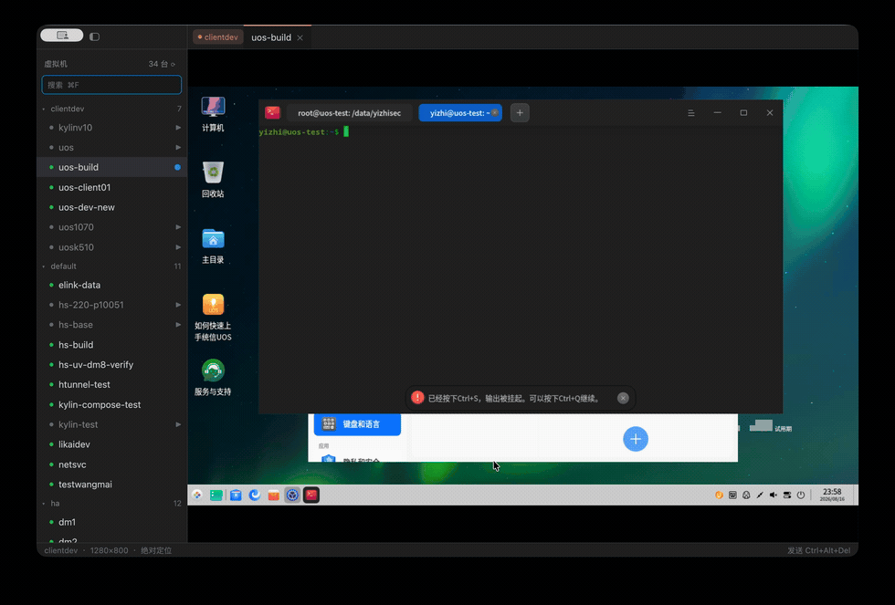

# inm

A native manager for [Incus](https://linuxcontainers.org/incus/) virtual
machines — macOS and Linux — with the SPICE console rendered **inside the
app**, no `remote-viewer` window, no browser.



## Why

`incus console --type vga` hands you off to an external SPICE viewer, one
window per machine. With a fleet spread across several Incus projects that
means a lot of window juggling, and every reconnect is a fresh handshake.

`inm` keeps every console you open as a tab. Background tabs stay connected, so
switching back is instant.

## Features

- **Project tree** — every VM across every Incus project, live status, search
  (`⌘F`), auto-refreshed.
- **Tab groups** — tabs are grouped by project the way Chrome groups tabs, with
  a stable colour per project and collapsible groups.
- **Embedded console** — the guest screen is decoded by spice-gtk and painted
  directly into the window; mouse and keyboard are forwarded to the guest.
- **Quick open** — `⌘P` to jump to any VM by name or project.
- **Right-click a VM** — open its console, start it, rename it (stopped VMs
  only), or see details: location/cluster member, architecture, profiles,
  CPU/memory limits, live memory usage, and per-interface IPv4 addresses.
- **Remote switching** — every remote from the `incus` CLI's own config, one
  click away in the sidebar header. Switching drops whatever the previous
  remote had open and starts fresh; there's no simultaneous multi-remote
  view.
- **Keyboard first** — `⌘1…9` switch tabs, `⌘W` close, `⌘B` toggle the sidebar.
  Hold `⌘` to reveal the tab numbers.
- **Non-QWERTY hosts** — a Dvorak host keyboard is reverse-mapped to physical
  key positions, so the guest applies its own layout instead of translating
  twice. Detected from the OS (macOS `HIToolbox`, Linux `setxkbmap`/
  `localectl`); override with `INM_LAYOUT=dvorak|qwerty`. The active layout is
  shown in the status bar.
- **Ctrl+Alt+Del** — sendable from the status bar, since a Mac keyboard cannot
  type it.

## How it works

```
Incus daemon REST API  ──►  data + control websockets  ──►  libspice-client-glib  ──►  gpui
  (local socket or TLS)         (SPICE byte stream)             (decode)              (paint)
```

- `inm` talks to the daemon directly — no `incus` CLI subprocess. A
  `POST .../console?type=vga` (the same call `incus console --type vga` makes
  internally) hands back a data and a control websocket secret; `inm` connects
  those itself and proxies the data channel onto a throwaway local Unix
  socket, since spice-client-glib only knows how to dial a filesystem path.
  SPICE opens one connection per channel (main/display/inputs/...), not one
  for the whole session, so this proxy keeps accepting and hands each new
  connection its own fresh websocket.
- Which daemon to talk to — a local Unix socket, or a remote host over TLS —
  is resolved from the `incus` CLI's own `~/.config/incus/config.yml`,
  including its self-signed pinned-certificate trust model
  (`~/.config/incus/servercerts/<remote>.crt`). Run `incus remote add` first
  to establish that trust; `inm` reuses it, it doesn't create it.
- Protocol and image decoding are spice-gtk's — the same library
  `remote-viewer` uses.
- All SPICE sessions share **one** GLib thread and one main loop. A
  `GMainContext` can only be owned by one thread, so a thread per session
  deadlocks.
- The UI is [gpui](https://www.gpui.rs/), Zed's GPU-accelerated framework.
  Frames are capped at 60fps by default (each one is a fresh GPU texture
  upload, not free) — lower it with `INM_FPS` on hardware that can't keep up.
  Hidden tabs skip conversion entirely.

## Requirements

A configured Incus remote (`incus remote add …`) — `inm` reuses the CLI's own
`~/.config/incus` configuration and credentials; it never asks for its own.

**macOS** (managing a remote Incus host — macOS has no local Incus daemon):

- Homebrew, `brew install incus spice-gtk`

**Linux**:

- `incus` and `spice-gtk` (Arch: `pacman -S incus spice-gtk`)
- Arch: [`inm`](https://aur.archlinux.org/packages/inm) on the AUR

## Build

**macOS**:

```sh
PKG_CONFIG_PATH=/opt/homebrew/opt/spice-gtk/lib/pkgconfig cargo build --release
```

**Linux** (`spice-gtk`'s own `pkg-config` file is on the default search path):

```sh
cargo build --release
```

## Status

A personal tool, built for a specific fleet.

## License

MIT
